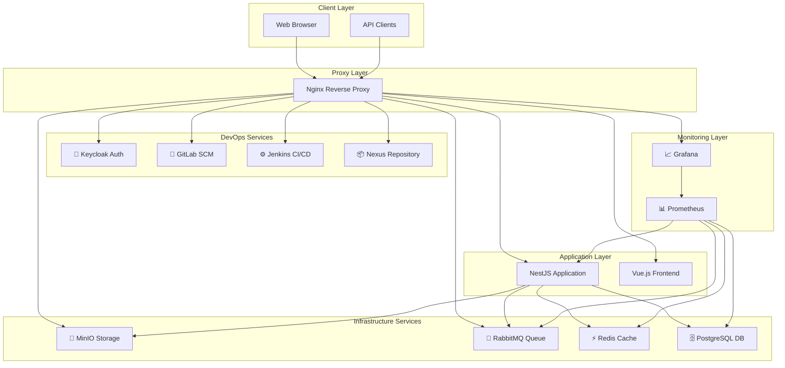

# 🚀 Complete DevOps Infrastructure with NestJS

> **A production-ready DevOps infrastructure setup with comprehensive CI/CD pipeline, monitoring, and microservices architecture.**

[](https://www.docker.com/)
[](https://nestjs.com/)
[](https://gitlab.com/)
[](https://www.jenkins.io/)
[](https://grafana.com/)

## 📋 Table of Contents

- [Overview](#-overview)
- [Features](#-features)
- [Architecture](#-architecture)
- [Quick Start](#-quick-start)
- [Services](#-services)
- [Documentation](#-documentation)
- [Contributing](#-contributing)

## 🌟 Overview

This repository contains a complete DevOps infrastructure setup that includes:

- **🔐 Authentication**: Keycloak for identity management
- **📂 Source Control**: GitLab with CI/CD pipelines
- **⚙️ Build Automation**: Jenkins for continuous integration
- **📦 Artifact Management**: Nexus repository manager
- **💾 Object Storage**: MinIO S3-compatible storage
- **📨 Message Queue**: RabbitMQ for async communication
- **📊 Monitoring**: Prometheus + Grafana stack
- **🌐 Reverse Proxy**: Nginx with SSL termination
- **🎯 Sample Application**: NestJS microservice

## ✨ Features

### 🐳 **Containerized Everything**
- Docker Compose orchestration
- Multi-environment support (dev/staging/prod)
- Health checks and auto-restart policies
- Volume management for data persistence

### 🔧 **Development Experience**
- One-command setup and teardown
- Local development with hot reload
- Comprehensive logging and monitoring
- Resource usage optimization

### 🚀 **Production Ready**
- SSL/TLS encryption
- Load balancing and reverse proxy
- Comprehensive monitoring and alerting
- Backup and disaster recovery guides

### 📈 **Monitoring & Observability**
- Real-time dashboards (Grafana)
- Metrics collection (Prometheus)
- Log aggregation
- Health checks and alerting

## 🏗️ Architecture



## ⚡ Quick Start

### Prerequisites
- **Docker Desktop** 4.0+ or Docker Engine 20.10+
- **Docker Compose** v2.0+
- **8GB RAM** minimum (16GB recommended)
- **50GB** free disk space

### 🚀 One-Command Setup

```bash
# Clone the repository
git clone https://github.com/yourusername/devops-infrastructure.git
cd devops-infrastructure

# Start everything (Windows)
deploy-infrastructure.bat

# Start everything (Linux/macOS)
chmod +x deploy.sh
./deploy.sh
```

### 🌐 Access Your Infrastructure

Once started, access the **main dashboard** at:
- **HTTP**: http://localhost
- **HTTPS**: https://localhost *(self-signed certificate)*

## 🛠️ Services

| Service | URL | Default Credentials | Purpose |
|---------|-----|-------------------|---------|
| **🏠 Main Dashboard** | http://localhost | - | Service overview |
| **🔐 Keycloak** | http://localhost:8080 | admin / dev123 | Authentication |
| **📂 GitLab** | http://localhost:8082 | root / password123 | Source control |
| **⚙️ Jenkins** | http://localhost:8081 | admin / admin123 | CI/CD |
| **📦 Nexus** | http://localhost:8083 | admin / admin123 | Artifacts |
| **💾 MinIO** | http://localhost:9001 | minioadmin / minioadmin | Object storage |
| **📨 RabbitMQ** | http://localhost:15672 | guest / guest | Message queue |
| **📊 Prometheus** | http://localhost:9090 | - | Metrics |
| **📈 Grafana** | http://localhost:3001 | admin / admin |Dashboards |

### 🌍 Reverse Proxy Access

For clean URLs, add to your hosts file (`/etc/hosts` or `C:\Windows\System32\drivers\etc\hosts`):

```
127.0.0.1 auth.local git.local ci.local nexus.local
127.0.0.1 storage.local rabbit.local prometheus.local grafana.local
```

Then access via:
- **Keycloak**: http://auth.local
- **GitLab**: http://git.local
- **Jenkins**: http://ci.local
- **Grafana**: http://grafana.local

## 📚 Documentation

### 📖 **Setup Guides**
- [**Setup & Usage Guide**](SETUP_AND_USAGE_GUIDE.md) - Complete setup instructions
- [**Infrastructure README**](INFRASTRUCTURE-README.md) - Infrastructure details
- [**Docker Setup Guide**](DOCKER_README.md) - Docker configuration
- [**Hosting Guide**](infrastructure/HOSTING_GUIDE.md) - Production deployment

### 🔧 **Configuration Guides**
- [**Grafana Setup**](GRAFANA-SETUP-GUIDE.md) - Monitoring configuration
- [**TypeORM Guide**](TYPEORM_README.md) - Database setup
- [**Resource Calculator**](RESOURCE-CALCULATOR.md) - Resource planning

### 🚀 **Operation Guides**
- [**App Integration**](INFRASTRUCTURE-APP-INTEGRATION.md) - Application integration
- **Quick Scripts**: `quick-start.bat`, `resource-monitor.bat`

## 🎛️ Management Scripts

### **🖥️ Windows Scripts**
```bash
deploy-infrastructure.bat     # Main deployment script
resource-monitor.bat         # Resource monitoring
grafana-dev-tester.bat      # Grafana testing
prepare-for-github.bat      # GitHub preparation
```

### **🐧 Linux/macOS Scripts**
```bash
./deploy.sh                 # Main deployment
make start                  # Alternative start
make stop                   # Stop services
make logs                   # View logs
```

## 🔧 Development

### **Environment Setup**
```bash
# Copy environment templates
cp lesson1/.env.copy.development lesson1/.env.development
cp lesson1/.env.copy.local lesson1/.env.local

# Install dependencies
cd lesson1
npm install

# Start development server
npm run start:dev
```

### **Database Migrations**
```bash
# Run migrations
npm run migration:run

# Create new migration
npm run migration:create -- MigrationName
```

### **Testing**
```bash
# Unit tests
npm run test

# E2E tests
npm run test:e2e

# Test coverage
npm run test:cov
```

## 📊 Monitoring

### **📈 Grafana Dashboards**
- **Infrastructure Overview**: System metrics and health
- **Application Metrics**: NestJS performance
- **Database Monitoring**: PostgreSQL statistics
- **Service Health**: All services status

### **🚨 Alerts**
- Service downtime detection
- Resource usage thresholds
- Database connection issues
- Memory and CPU alerts

## 🔒 Security

### **🛡️ Development Environment**
- Self-signed SSL certificates
- Default passwords (change for production)
- Local network access only
- Docker internal networking

### **🏭 Production Considerations**
- Use proper SSL certificates (Let's Encrypt, CA-signed)
- Change all default credentials
- Configure firewall rules
- Implement secrets management
- Set up backup strategies

## 🤝 Contributing

1. **Fork** the repository
2. **Create** your feature branch (`git checkout -b feature/amazing-feature`)
3. **Commit** your changes (`git commit -m 'Add amazing feature'`)
4. **Push** to the branch (`git push origin feature/amazing-feature`)
5. **Open** a Pull Request

### **📋 Development Guidelines**
- Follow existing code style
- Add tests for new features
- Update documentation
- Test with provided scripts

## 🆘 Support

### **🐛 Common Issues**
- **Services won't start**: Check Docker resources and ports
- **Bad Gateway errors**: Verify service health with `docker ps`
- **SSL warnings**: Normal for development (self-signed certificates)
- **Port conflicts**: Stop conflicting services or change ports

### **📞 Getting Help**
- Check the [Setup Guide](SETUP_AND_USAGE_GUIDE.md)
- Review service logs: `docker logs [container-name]`
- Use resource monitor: `resource-monitor.bat`
- Open GitHub Issues for bugs

## 📜 License

This project is licensed under the MIT License - see the [LICENSE](LICENSE) file for details.

## 🙏 Acknowledgments

- **NestJS** team for the excellent framework
- **Docker** community for containerization tools
- **Grafana Labs** for monitoring solutions
- **HashiCorp** for infrastructure tools
- **GitLab** for DevOps platform

---

## 🚀 Ready to Start?

```bash
# Get started in 3 commands:
git clone https://github.com/yourusername/devops-infrastructure.git
cd devops-infrastructure
deploy-infrastructure.bat  # Choose option 1
```

**Then visit**: http://localhost 🎉

---

<div align="center">

**⭐ Star this repository if it helped you!**

Made with ❤️ for the DevOps community

</div>
